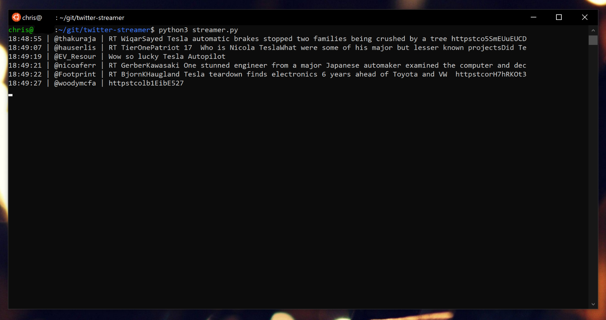

# twitter-streamer

## Description



The [twitter-streamer](https://github.com/ckuzma/twitter-streamer) widget/app was written as a test utility for another Python application.  However, it developed into a neat little visual livetime display of tweets as they happen with relation to particular topics.  Run in the corner of one's display, it offers a glimpse of what is happening anywhere in the world that is of interest.  (The example above shows a short run with "tesla" used as the topic phrase.)

## How to use
0. Ensure your system fulfills the requirements by first installing Python 3.x and then installing the required Python libraries like so:
    ```
    pip3 install -r requirements.txt
    ```

1. Create credentials for a Twitter app on the [Twitter Developer Portal](https://developer.twitter.com/).  Specifically, you will need these four things in order to run the streamer:
    1. Consumer Key
    2. Consumer Secret
    3. Application Token
    4. Application Secret

2. Copy the [`creds.json.bak`](creds.json.bak) file and rename it `creds.json`

3. Fill out `creds.json` using the keys, token, and secret that you acquired in step 1 above.

4. Also enter in a topic (or multiple) beginning on [line 7](https://github.com/ckuzma/twitter-streamer/blob/master/creds.json.bak#L7) of `creds.json`.  Good examples include person, company, or city names.

6. Run the app from the terminal:
    ```
    python3 streamer.py
    ```

7. To stop, simply terminate the process by closing the window or initiating it by pressing `CTRL` + `c` on your keyboard.